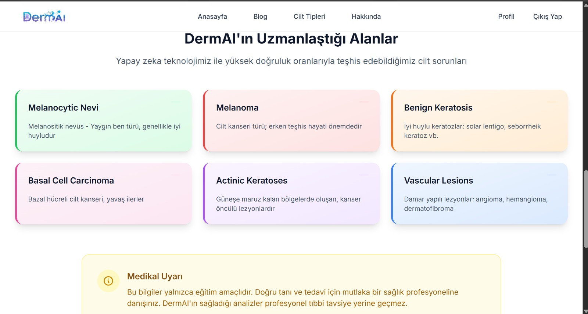

## **Takım İsmi**

**Rapid Devs**

---
## **Takım Logosu**

---

## **Takım Elemanları**

| 
Name
 | 
Title
 | 
Socials
 |
| :------------: | :------------: | :------------: |
|  | **Sude Özübek**   Product Owner |  |
|  | **Furkan Aras**   Scrum Master |  |
|  | **Batuhan Umay**   Backend Developer |  |
|  | **Ayşe Verda Gülcemal**   Frontend Developer |  |
|  | **Rabia Yılmaz**   Data Engineer |  |

---

## **Proje İsmi**

**DermAI**

---

## **Proje Açıklaması**

**DermAI**, kullanıcıların cilt görsellerini yükleyerek potansiyel cilt rahatsızlıklarına dair **erken uyarı** niteliğinde yapay zeka destekli ön bilgilendirme sunan bir platformdur. Tanı koymak yerine, farkındalık oluşturarak kullanıcının sağlık kuruluşuna başvuru motivasyonunu artırmayı hedefler.

---

## **Kullanım Senaryosu**

- Kullanıcı sisteme cilt görselini yükler.
- Görsel, HAM10000 veri setiyle eğitilmiş AI modeli tarafından analiz edilir.
- Model, olasılık tahmini yapar.
- Kullanıcı Gemini destekli Chatbot üzerinden detaylı açıklama alır.
- Premium üyelikle rapor kaydı ve ek analizler sağlanır.

---

## **Hedef Kitle**

- Cilt sağlığı konusunda bilinçlenmek isteyen genç yetişkinler
- Dijital sağlık okuryazarlığını artırmak isteyen herkes
- Erken teşhis için ben, akne, leke takibi yapmak isteyen kullanıcılar

---

## **Product Backlog**

[Trello Board Linki](https://trello.com/invite/b/6866be4097df812fc254a5cc/ATTI51ebcbd29a28cf54af86b62823427c4fD08A05D6/skinsentinel)

---

# **Sprint 1**

- **Sprint Notları**: User Story’ler Trello kartlarında detaylı biçimde yazılmıştır. Kartlara tıklandığında görev kapsamları görülebilir. Yeterince açıklayıcı görev adı olan kartlarda görev kapsamları eklenmemiştir.

- **Sprint içinde tamamlanması tahmin edilen puan**: 100 Puan

- **Puan tamamlama mantığı**: Projenin toplamda 300 puanlık backlog’u vardır. Sprint 1 için 100 puan planlanmıştır ve sprint sonunda tamamlanmıştır.

- **Backlog düzeni ve Story seçimleri**: Backlog, veri temizliği, backend API taslağı, frontend yükleme formu, Gemini entegrasyonu planlama gibi temel adımları kapsayacak şekilde seçilmiştir.

- **Daily Scrum**: Meet üzerinden haftada 2 gün toplantı yapılarak yürütülmüştür Ekran görüntüleri:
- [Sprint 1 - Daily Scrum Chats](https://imgur.com/a/GJECLl9)

- **Sprint Board Güncellemesi**: Sprint 1 görevleri tamamlanarak Done sütununa taşınmıştır. Sprint 2 için planlanan işler Sprint Backlog ve In Progress sütunlarına taşınarak çalışma süreci başlatılmıştır. Güncel sprint board durumu aşağıda yer almaktadır.

  

---

 
<h3>Ürün Durumu: Ekran Görüntüleri</h3>

  
  
  
  
  

  

## **Sprint Review**

Sprint 1 kapsamında ekip, projenin temel iskeletini tamamlayarak önemli ilerleme kaydetti.
Backend tarafında veritabanı yapısı ve güvenlik ayarları kuruldu, temel front-end render yapısı ve kullanıcı giriş-çıkış işlemleri hazırlandı. Gemini API başarıyla entegre edilerek kullanıcıdan gelen metin/görsel verisinin işlenmesi sağlandı ve testleri Postman üzerinden doğrulandı.
Frontend tasarımda splash ekran, chatbot arayüzü, kullanıcı yönetimi ve içerik sayfalarının taslakları hazırlandı. Veri tarafında HAM10000 veri seti seçildi ve ön analizleri tamamlandı.
Ekip, çıktıları gözden geçirerek eksik noktaları belirledi ve sonraki sprint için düzenleme kararları aldı.
 
Sprint Review katılımcıları: Sude Özübek, Furkan Aras, Batuhan Umay, Ayşe Verda Gülcemal, Rabia Yılmaz

## Sprint Retrospective

Ekip Sprint 1 sonunda genel iş paylaşımını değerlendirdi ve herkesin proje akışına katkısının net olduğu görüldü. Veri bilimi tarafında Furkan Aras ve Rabia Yılmaz, model eğitimi üzerine çalışmaya devam edecek. Batuhan Umay backend geliştirmeye odaklanırken, Sude Özübek API entegrasyonu ve backend sürecine destek verecek, Ayşe Verda Gülcemal ise frontend tasarımını ilerletecek.

---

# **Sprint 2**

- **Sprint Notları**: User Story’ler Trello kartlarında detaylı biçimde yazılmıştır. Kartlara tıklandığında görev kapsamları görülebilir. Yeterince açıklayıcı görev adı olan kartlarda görev kapsamları eklenmemiştir.

- **Sprint içinde tamamlanması tahmin edilen puan**: 100 Puan

- **Puan tamamlama mantığı**: Projenin toplamda 300 puanlık backlog’u vardır. Sprint 2 için 100 puan planlanmış, işlerin büyük çoğunluğu tamamlanmış ve bazı maddeler Sprint 3’e aktarılmıştır.

- **Backlog düzeni ve Story seçimleri**: Bu sprintte kullanıcı oturum yönetimi, loglama, frontend responsive testler, model eğitimi, veri artırma stratejisi ve Gemini API entegrasyonu gibi sistemin çalışabilirliğini sağlayan temel adımlar seçilmiştir. Veri bilimi tarafında DenseNet121 modeli ile yapılan eğitim süreci bu sprintte başarıyla tamamlanmıştır.

- **Daily Scrum**: Meet üzerinden haftada 2 gün toplantı yapılarak yürütülmüştür. Sprint 2 Daily Scrum ekran görüntüleri:  
- [Sprint 2 - Daily Scrum Chats](https://imgur.com/a/TgAoPFW)

- **Sprint Board Güncellemesi**: Sprint 2 görevleri tamamlandıkça Done sütununa taşınmıştır. Sprint 3 için planlanan işler Sprint Backlog'da bekletilmekte ve önceliklendirilmektedir. Güncel sprint board durumu aşağıda yer almaktadır.

---

 
<h3>Ürün Durumu: Ekran Görüntüleri</h3>

  
  
  
  

  

## **Sprint Review**

Sprint 2 kapsamında ekip, sistemin temel işlevlerini bir araya getirerek çalışır bir uygulama bütünlüğü sağlamaya odaklandı.  
Backend tarafında kullanıcı oturum yönetimi, loglama altyapısı ve Gemini API için gerekli entegrasyon testleri gerçekleştirildi. Frontend tarafında responsive tasarım güncellemeleri tamamlandı ve arayüz testleri ile sistem uyumluluğu doğrulandı.  
Veri bilimi tarafında model eğitimi süreci **DenseNet121 mimarisi** kullanılarak başarıyla tamamlandı. Eğitim ve doğrulama verileriyle yapılan testler sonucu elde edilen metrikler analiz edildi. Bu sprint ile birlikte model eğitimi süreci tamamlandı; kalan işler final raporlama ve çıktıların proje deposuna eklenmesi olarak planlandı.  
Sprint boyunca planlanan işlerin büyük bölümü tamamlandı, premium özellikler ise Sprint 3’e aktarıldı.  
Ekip, mevcut çıktıları değerlendirerek bir sonraki sprint için öncelikli işleri netleştirdi.

**Sprint Review katılımcıları:** Sude Özübek, Furkan Aras, Batuhan Umay, Ayşe Verda Gülcemal, Rabia Yılmaz

## Sprint Retrospective

Ekip Sprint 2 sonunda proje sürecini genel hatlarıyla değerlendirdi. Tüm üyelerin sorumluluklarını zamanında ve uyumlu bir şekilde tamamladığı görüldü.  
Veri bilimi tarafında model eğitimi tamamlandı, Sprint 3’e yalnızca **Confusion Matrix & final metrik raporu** ile **model çıktısının repo’ya eklenmesi** gibi son dokümantasyon görevleri bırakıldı.  
Backend ve frontend taraflarında kalan işlerin daha hızlı ilerleyebilmesi için odak noktası yazılım stabilitesi ve kullanıcı deneyimi olarak belirlendi.  
Premium modüller, entegrasyonları ve erişim kontrolleri için Sprint 3’e taşındı.

Sprint 3’te ekip, genel sistem kararlılığını artırmaya, çıktıları ürünleştirmeye ve kullanıcıya sunulabilir hale getirmeye odaklanacaktır.

---

# **Sprint 3**

- **Sprint Notları**: User Story’ler Trello kartlarında detaylı biçimde yazılmıştır. Kartlara tıklandığında görev kapsamları görülebilir. Yeterince açıklayıcı görev adı olan kartlarda görev kapsamları eklenmemiştir.

- **Sprint içinde tamamlanması tahmin edilen puan**: 100 Puan

- **Puan tamamlama mantığı**: Toplam 300 puanlık backlog’un son 100 puanlık kısmı Sprint 3’e ayrılmıştır. Sprint 3 sonunda sistemin MVP (Minimum Viable Product) versiyonu tamamlanmıştır.

- **Backlog düzeni ve Story seçimleri**: Sprint 3’te proje ürünleştirmeye odaklanmış, kullanıcı deneyimi ve yazılım kararlılığı önceliklendirilmiştir. Veri bilimi tarafında model çıktılarının analizi ve Confusion Matrix oluşturulmuştur. Ayrıca model çıktısı projeye entegre edilmiştir.

- **Daily Scrum**: Meet üzerinden haftada 2 gün toplantı yapılarak yürütülmüştür. Ekran görüntüleri:  
- [Sprint 3 - Daily Scrum Chats](https://imgur.com/a/zMh2x8N)
  
- **Sprint Board Güncellemesi**: Tüm tamamlanan görevler Done sütununa taşınmış, yapılmayan işler product backlog’a alınmıştır.  
  Güncel sprint board durumu aşağıdadır:

---

 
<h3>Ürün Durumu: Ekran Görüntüleri</h3>

  
    
    
  
    
  
    
  
  

---

## **Sprint Review**

Sprint 3 kapsamında proje tamamlanma aşamasına getirilmiştir.  
Backend tarafında kullanıcı yetkilendirme, log yönetimi ve Gemini API ile chatbot sistemi başarıyla çalıştırılmıştır.  
Frontend tarafında responsive tasarım son hâline getirilmiştir. Veri bilimi tarafında daha önce eğitilen DenseNet121 modelinin çıktıları incelenmiş; Confusion Matrix ve Classification Report gibi temel değerlendirme araçlarıyla modelin performansı gözlemlenmiştir. Model çıktısı arayüze bağlanarak proje bütünlüğü sağlanmıştır.  

Sprint sonunda MVP başarıyla oluşturulmuş, premium modüller ise zaman yetersizliği nedeniyle backlog’ta bırakılmıştır. Bu özellikler potansiyel olarak ileri faz projelerde ele alınacaktır.

**Sprint Review katılımcıları:** Sude Özübek, Furkan Aras, Batuhan Umay, Ayşe Verda Gülcemal, Rabia Yılmaz

---

## **Sprint Retrospective**

Ekip Sprint 3 sonunda genel bir değerlendirme yaparak proje sürecini tamamladı.  
Scrum yapısının düzenli kullanılması, takım içi iletişimin güçlü kalmasını sağlamıştır. MVP seviyesinde çalışan bir ürün ortaya çıkarılmış, kod kalitesi ve sistem kararlılığı önemli ölçüde artırılmıştır. 
